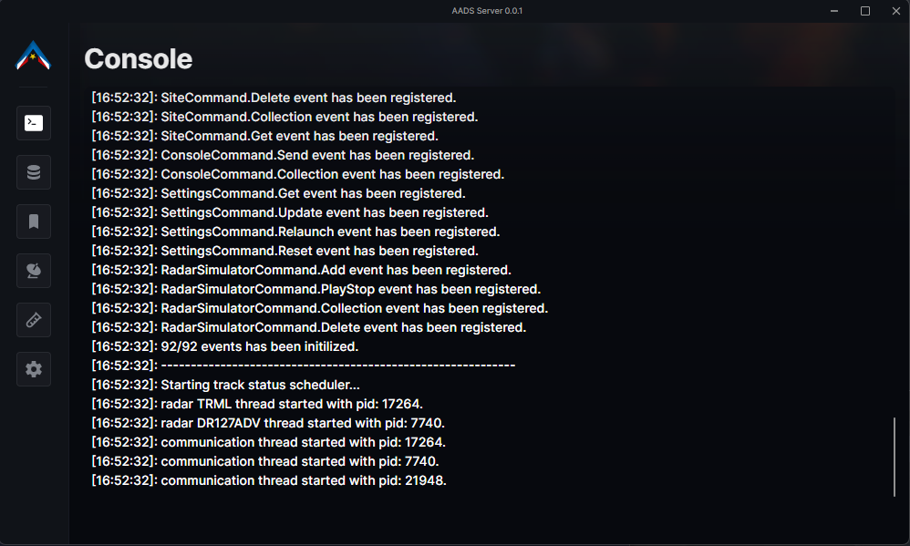

<h1 align="center">✨ William Siefert ✨</h1>

    

    <i>
        "Formal education will make you a living; self-education will make you a fortune. --Jim Rohn"
    </i>

A passionate developer who is interested in how things work. I enjoy working collaboratively but I can also work independently. I’m looking to join forces with a company to continue to grow my skill set while contributing with others.
 
<a align="center" href="https://github.com/king-glitch">Github Homepage with stats</a>
 

📛 William Siefert   📠Bangkok, TH.   🂠25 November, 1999  

## Table of Contents 📦

-   [Hard Skills 🤹🏻](#hard-skills-)
-   [Soft Skills ⚓](#soft-skills-)
-   [Languages 🗣️](#languages-)
-   [Interests 🤖](#interests-)
-   [Educations 🏫](#educations-)
-   [Work Experience 🧑‍💼](#work-experience-)
-   [Projects 🚧](#projects-)
-   [Languages & Tools ⚒️](#languages--tools-%EF%B8%8F)
-   [Contacts 🐧](#contacts-)

## Hard Skills 🤹🏻

-   Coding [Languages & Tools](#languages--tools)
-   Logical Programming

## Soft Skills ⚓

-   Complex Problem Solving.
-   Collaboration.
-   Adaptability.
-   Time Management.
-   Life-Long Learning.

## Languages 🗣️

-   Thai - Native
-   English - Good

## Interests 🤖

-   Web Development
-   Software Development
-   Full-Stack Development

## Educations 🏫

-   Bankok University, Since 2019 - Present
    -   School of Information Technology and Innovation, Computer Science.

## Work Experience 🧑‍💼

-   Joined Bangkok University Multimedia Intelligent Technology as a member. Since 1st June 2022 - Present

## Projects 🚧

-   School Bus Platform to avoid trapped kindergarten students. 🚌
    -   A platform to alert parents when there is a student trapped in the bus.
    -   Build and develop web applications with RESTFUL api with Django as a back-end and Next.js as a front-end. Allow
        mobiles and raspberry pi to communicate with RESTFUL api.
-   AADS (Army Air Defense System). ✈️
    -   A military program to control aircrafts from surveillance radars around Thailand.
    -   Build, implement and develop both client side using C#, .net, Gmap.net, winforms and server side using Node.js,
        SQL. Server and client communicated by socket. 
        
-   Spare Time & School Projects. 📚
    -   [View Projects](https://github.com/king-glitch?tab=repositories)

## Languages & Tools ⚒️

                            

## Contacts 🐧

 

